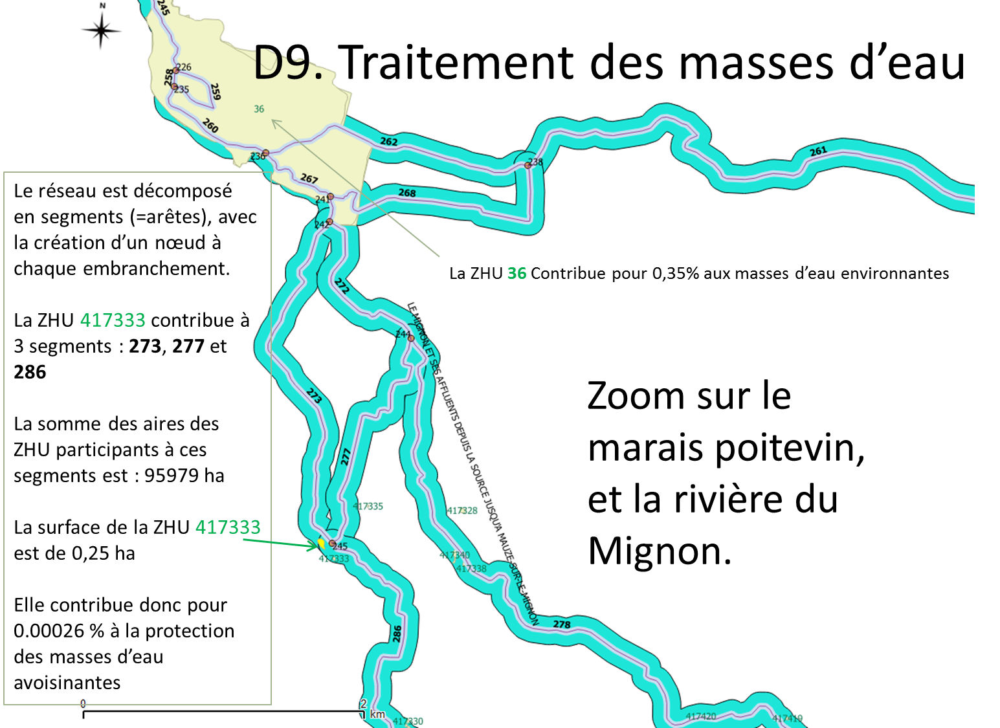
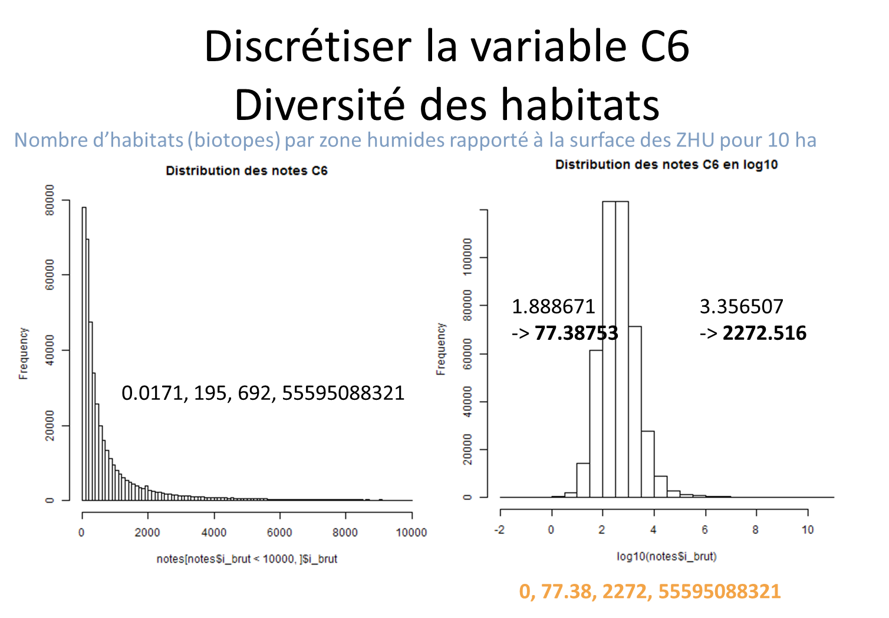
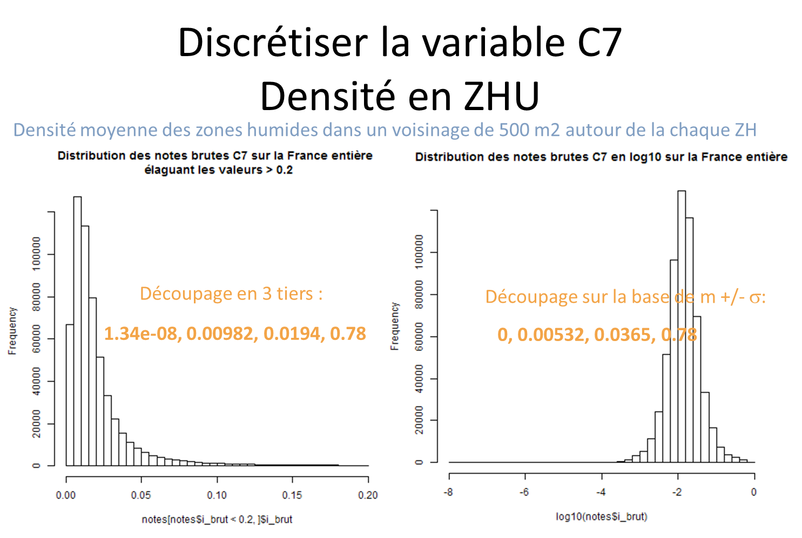

# DISA-forum

<!-- vscode-markdown-toc -->
* 1. [Phase 1 : calculs d'indicateurs sur les zone humides (600 000 environ en 2017 sur la France entière)](#Phase1:calculsdindicateurssurleszonehumides600000environen2017surlaFranceentire)
	* 1.1. [Thème 1 -  Connaissances réglementaires](#Thme1-Connaissancesrglementaires)
	* 1.2. [Thème 2 - Economiques, sociétal et culturels](#Thme2-Economiquessocitaletculturels)
	* 1.3. [Thème 3 - Biologie et écologie des milieux](#Thme3-Biologieetcologiedesmilieux)
	* 1.4. [Thème 4 - Eau](#Thme4-Eau)
* 2. [Phase 2 : calibration d'indicateurs sur les zone humides (600 000 environ en 2017 sur la France entière)](#Phase2:calibrationdindicateurssurleszonehumides600000environen2017surlaFranceentire)
	* 2.1. [Thème 3 - Biologie et écologie des milieux](#Thme3-Biologieetcologiedesmilieux-1)
	* 2.2. [ Thème 4 - Eau](#Thme4-Eau-1)

<!-- vscode-markdown-toc-config
	numbering=true
	autoSave=true
	/vscode-markdown-toc-config -->
<!-- /vscode-markdown-toc -->

Projet mené avec le Forum des Marais Atlantiques (Fabien Blanquet) entre Avril 2017 et Novembre 2017

Aide à l'analyse multi-critère des zones humides, par le calcul et la calibration d'indicateurs (Christine Plumejeaud-Perreau) décrivant l'intérêt des zones humides (ZHU)

##  1. Phase 1 : calculs d'indicateurs sur les zone humides (600 000 environ en 2017 sur la France entière)

script SQL [*calcul_indicateurs.sql*](./sql/calcul_indicateurs.sql)

###  1.1. Thème 1 -  Connaissances réglementaires

**indicateur A1 natura_2000** : une ZHU est plus intéressante (note  = 3) si elle intersecte une zone natura 2000

**indicateur A3 inpn_biotope** : une ZHU est plus intéressante (note  = 3) si elle intersecte une zone INPN (couche apb - arrêté de protection de biotope)

###  1.2. Thème 2 - Economiques, sociétal et culturels

Dans la table fma.valeurs_socio_eco, on trouve ceci  :
2;"Autres";" À préciser en remarque";1  -> B10
3;"Pas de valeur socio-économique identifiée";"";2
4;"Production et stockage d'eau potable";"";3 -> B1
5;"Production biologique";" Aquaculture, pêche, chasse";4 -> B2
6;"Production agricole et sylvicole";" Pâturage, fauche, roseaux, sylviculture";5 -> B3
7;"Production de matière première";" Granulat, tourbe, sel, etc.";6 -> B4
8;"Intérêt pour la valorisation pédagogique/éducation";"";7 -> B5
9;"Paysage, patrimoine culturel, identité locale";"";8 -> B6
10;"(Intérêt pour les loisirs/valeurs récréatives)";"";9 -> B7
11;"Valeur scientifique";"";10 -> B8
14;"Tourisme";"''";11 -> B9

**indicateur B1 se_eaupot** : croisement avec la table vse (valeur socio-économique) pour le thème eau (4), et lecture du niveau d'intérêt déclaré associé

###  1.3. Thème 3 - Biologie et écologie des milieux

**indicateur C6 bio_densiterichesse** : diversité des habitats/biotopes présents sur les ZHU rapportées à 10 ha.
Attention, beaucoup de ZHU < 10 ha

**indicateur C7 bio_densitezhu** : Plus les ZHU sont proches, et en grande quantité, plus l'intérêt paysager et écologique est important.
Via une grille de 500 m de côté, on calcule la densité de ZHU autour de la ZHU d'intérêt.

**indicateur C8 biopotentielzhu** : Distance moyenne à la ZHU la plus proche. A faire

###  1.4. Thème 4 - Eau

Insertion des données de captage en France (fournie par FMA) et du référentiel RGE de l'IGN sur la France : point_eau; surface_eau; referentiels.troncon_cours_eau;
Intégration d'une couche de linéaire "masses d'eau" issue de Carthage ou Sandre (fournie par FMA), qui contient les cours d'eau souterrains et surfaciques.

**indicateur D1 eau_superficie** : Soutien d'étiage aux cours d'eau, proportionnelle à la surface des ZHU. Creation de zones tampons de 50 m autour des ZHU, agrégation puis analyse des aires des agrégats : faible si < 3ha, moyenne si <= 10 ha, grande si > 10 ha. Le tampon permet de dépasser le problème d'hétérogénéité des digitalisations de ZHU réalisées à des degrés de détails très divers sur l'ensemble de la France.

**indicateur D2 eau_connexion** : régulation des crues en fonction de la connexion au réseau hydrographique. Plus la ZHU est proche du réseau hydrographique, plus son rôle tampon dans l'écoulement de l'eau est supposé important. Faible si > 100 m, moyen entre 25 et 100 m, fort si < 25 m. Le réseau lineaire non fictif et le réseau surfacique naturel est ici pris en compte dans le calcul. C'est-à-dire que pour un lac, on prend la distance au bord du lac et on à l'axe fictif qui passe au milieu du lac.

**indicateur D8 eau_captage** : la zone humide se situe dans un périmètre de captage d'eau et contribue à améliorer la qualité de l'eau (interception des MES et des toxiques, régulation des nutriments). Faible si > 500 m, moyen entre 150 et 500 m, fort si < 150 m.

**indicateur D9 eau_masse** : connaitre l'état écologique de la masse d'eau en lien avec la zone humide. Calcul de la contribution d'une ZHU (en surface) à la protection des masses d'eau situées à moins de 100 m d'elle, au niveau du tronçon de ces masses d'eau. Les masses d'eau sont décomposées en segments d'un réseau, et pour chaque segment, dans un rayon de 100m, on calcul la contribution relative des aires des ZHU (en %).

##  2. Phase 2 : calibration d'indicateurs sur les zone humides (600 000 environ en 2017 sur la France entière)

scripts R  [*calibrate.r*](./r/calibrate.r)

###  2.1. Thème 3 - Biologie et écologie des milieux

**indicateur C6 bio_densiterichesse** : diversité des habitats/biotopes présents sur les ZHU rapportées à 10 ha.
Attention, beaucoup de ZHU < 10 ha

Calibration par moyenne +/- écart-type sur le logarithme des valeurs :

**indicateur C7 bio_densitezhu** : Plus les ZHU sont proches, et en grande quantité, plus l'intérêt paysager et écologique est important.
Via une grille de 500 m de côté, on calcule la densité de ZHU autour de la ZHU d'intérêt.

Calibration par moyenne +/- écart-type sur le logarithme des valeurs :

###  2.2.  Thème 4 - Eau

**indicateur D9 eau_captage** : connaitre l'état écologique de la masse d'eau en lien avec la zone humide. Calcul de la contribution d'une ZHU (en surface) à la protection des masses d'eau situées à moins de 100 m d'elle, au niveau du tronçon de ces masses d'eau. Les masses d'eau sont décomposées en segments d'un réseau, et pour chaque segment, dans un rayon de 100m, on calcul la contribution relative des aires des ZHU (en %).

